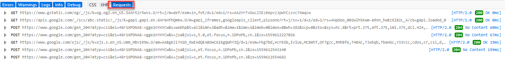

# Eavesdropping on the Server

Every time someone uses the internet or a network, a client sends a message to a server, and that server responds. Explore the relationship between `client` and `server` in more detail by navigating the web with an internet browser and eavesdropping in on the communications sent between `client` and `server`. Review the data that is sent between client and server with an internet browser's developer console.

The process to launch the developer console for an internet browser is different for each browser.
Links to documentation for Firefox, Chrome, and Safari can be found [here](https://support.airtable.com/hc/en-us/articles/232313848-How-to-open-the-developer-console).

## Instructions

Navigate to the below websites with the developer console open to review the exchanges between client (browser) and server (websites visited).

1. Open an internet browser, and launch the developer console. Consult the [documentation](https://support.airtable.com/hc/en-us/articles/232313848-How-to-open-the-developer-console) for help with getting the developer console open. Instruction is provided for each browser.

2. Select `requests`.

  

3. Navigate to `https://google.com`.

4. Review the output in the developer console. Compare the `POST` requests with the `GET` requests.

5. Scroll to the top of the console and identify the first request sent to the server. This was the first message sent by the client to the server when the site was accessed.

6. Return to Google with the console open and search Google with the phrase `FinTech`.

7. Review the output in the developer console.

8. Visit `https://nasdaq.com` and search for a ticker. Review the developer console as you submit the request.

9. Continue to navigate the internet with the developer console open. Take not of the type of requests that are sent for each site visited (how many POST vs GET). Also take into consideration the differences in API URLs.

- - -

© 2019 Trilogy Education Services
