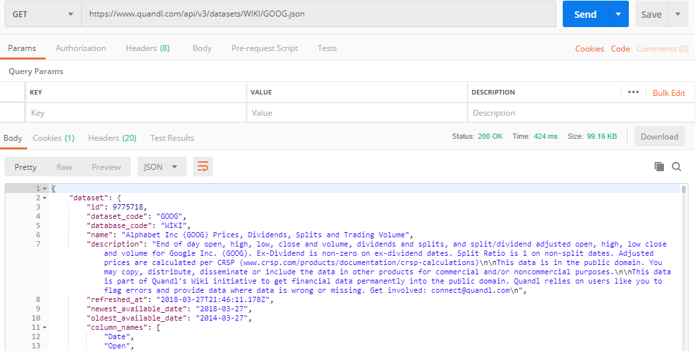
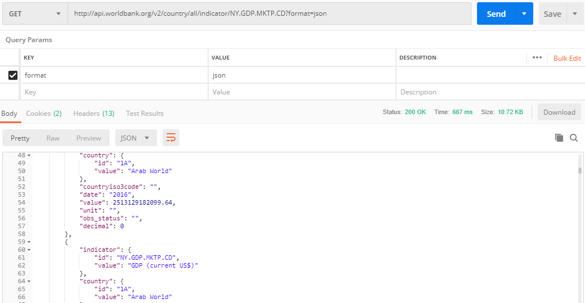
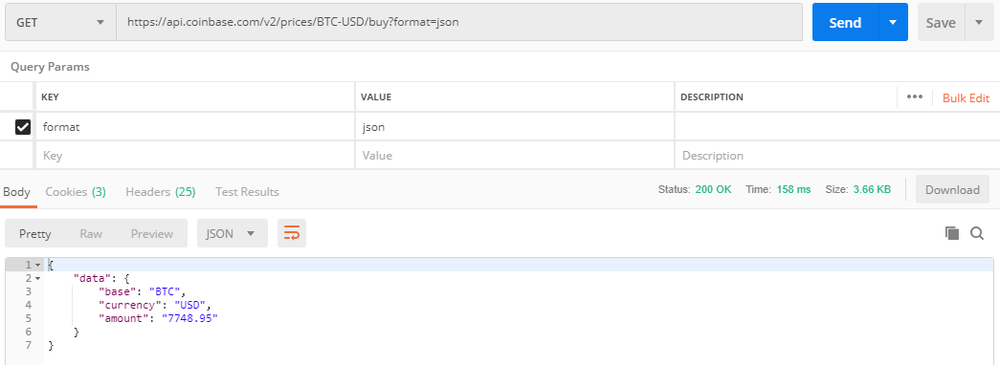
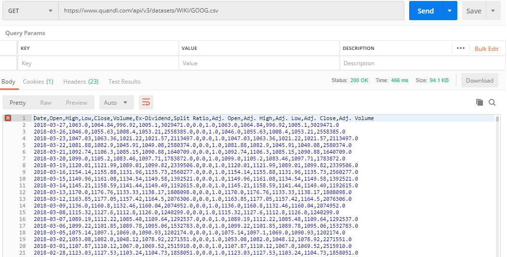

## I Spy, an API

1. Get `GOOG` stock data using `Quandl API`.

    ```
    GET https://www.quandl.com/api/v3/datasets/WIKI/GOOG.json
    ```

    

2. Extract `GDP` data for the `US` using `World Bank API`.

    ```
    http://api.worldbank.org/v2/country/all/indicator/NY.GDP.MKTP.CD?format=json
    ```

    

3. Identify the current `Bitcoin` price using `Coinbase API`.

    ```
    https://api.coinbase.com/v2/prices/BTC-USD/buy?format=json
    ```

    

4. Get `GOOG` stock data in `CSV` format using `Quandl API`. Take note of how the change in URL alters the format (json vs csv) of the data returned by the API.

    ```
    https://www.quandl.com/api/v3/datasets/WIKI/GOOG.csv
    ```

    
