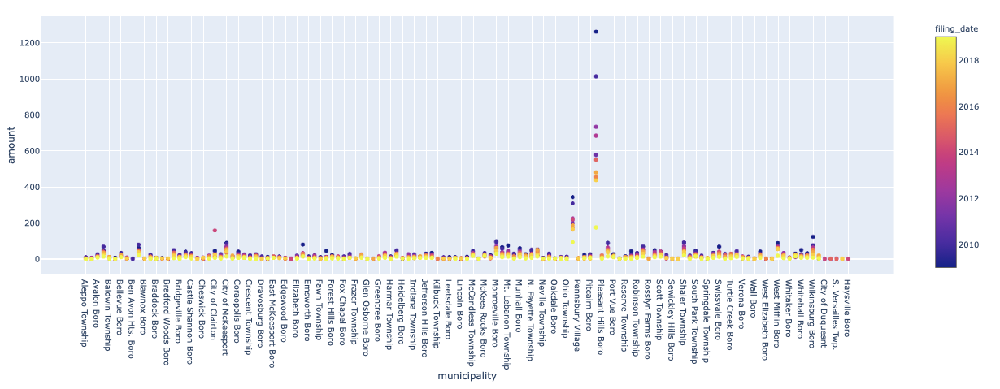
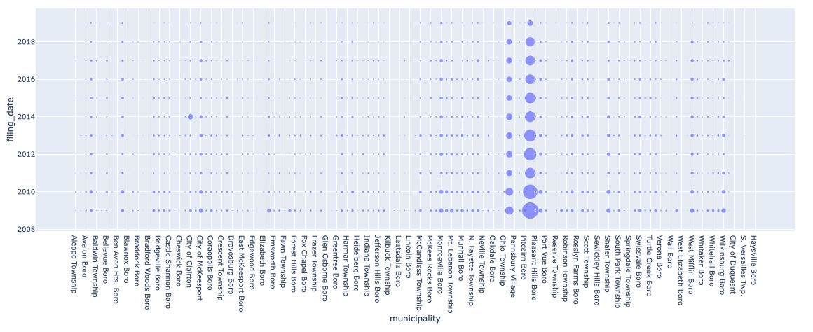
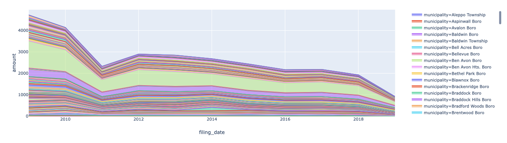

# Plotting with Plotly

Congratulations! You've been invited to the second round of the REMAX interview process for the data analyst role in the Business Intelligence department.

Now satisfied with your skills in **hvPlot**, the interviewers now want to better understand your competency using **Plotly Express**. REMAX  uses the **Plotly** platform, so the team needs to confirm that you'll be a good fit for their current development ecosystem.

Using **Plotly Express** and the provided real estate data, correlate the Pennsylvania Allgehany County sales data with foreclosures. The goal is to demonstrate to the interviewers that you can understand real estate reporting requirements and develop visualizations that tell stories through data, especially as it relates to market targeting.

Complete this activity successfully, and you'll continue onto the next phase of the interview process.

## Instructions

1. Read in the Allgehany housing foreclosure data.

2. Slice the foreclosure data for Series **municipality** and **amount**.

3. Group data by **index.year** and **municipality**, and then perform a `count`. Hint: This will require a **DateTimeIndex**.

4. Create a **scatter** plot. The plot should resemble the below screenshot. Make sure to specify the appropriate `x` and `y` axes for a **scatter** plot.

    

5. Plot the relationship between filing date and municipality using a **scatter** plot. The plot should resemble the below screenshot.

    

### Challenge

Plot the progression of foreclosures using an area chart to determine if the rate of foreclosures has increased or decreased over the years. Make sure to specify a Series for the `color` and `line_group` attributes.

  

### Hint

Creating an **area** plot can be done using the Plotly Express `area` function.

© 2019 Trilogy Education Services, a 2U, Inc. brand. All Rights Reserved.
