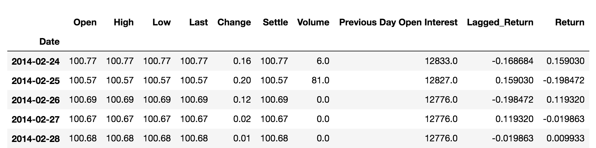
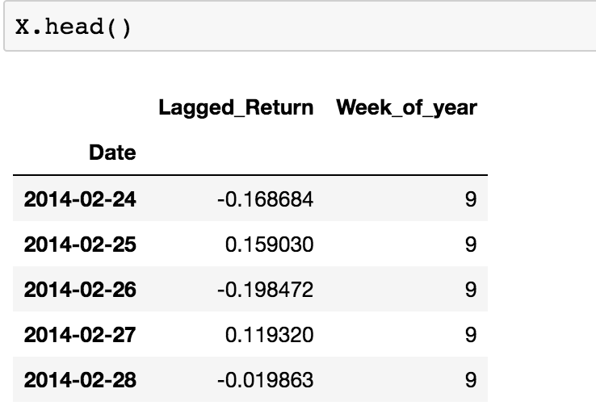
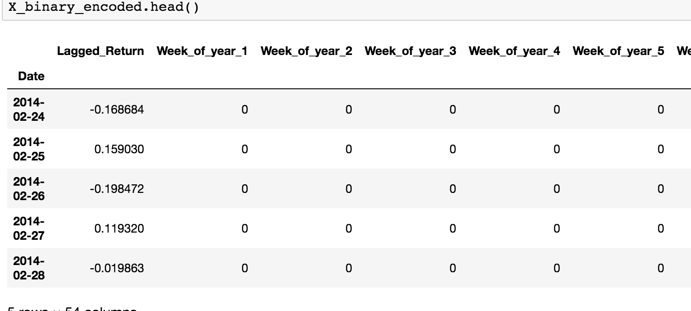

## Oil Futures Regression

### Instructions

In this activity, you will use linear regression to predict oil futures returns with lagged oil futures returns, and to investigate seasonal effects in the pricing of oil futures.

Follow the directions in the starter Jupyter notebook, but consult the below if necessary.

Prepare the data with the following steps:

  * Read the CSV in Pandas. You will use the data in the settle price column (see [https://www.investopedia.com/terms/s/settlementprice.asp](https://www.investopedia.com/terms/s/settlementprice.asp) for more on futures settle prices).

  * Instead of using settle prices directly, create a column of returns: the percentage change from one day to the next. Multiply the results by 100 for ease of interpretation. This column will be your dependent variable (y).

  * Create a column of **lagged returns**. This is done by using `shift()` to shift down the column of returns by 1. This column will be your independent variable (X).

  * Drop NaN values from the data frame with `dropna()`.

  * Your data frame should look like this:

  

Next, reshape the data by transforming the lagged returns column into a data frame, and adding a week of the year column:

  

Next, assign dummy variables to the weeks of the year:

  

Finally, fit a linear regression model to the data, compute the metrics, and to assess your findings.

Provide and interpret the following metrics:

* R2 score

* Mean squared error

* Root mean squared error

* Standard deviation of futures return

© 2019 Trilogy Education Services, a 2U, Inc. brand. All Rights Reserved.