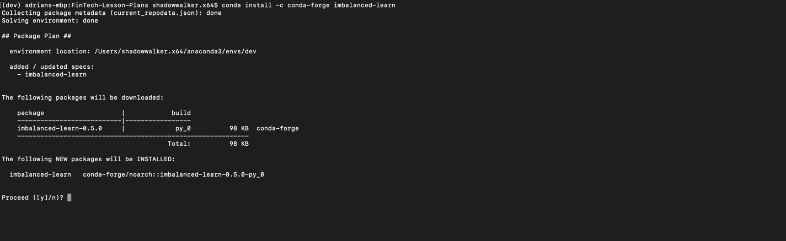

# Machine Learning Environment Setup Guide

This guide serves as a step by step process for setting up and validating the tools required for the machine learning portion of the curriculum. Many of these tools are needed to train and test machine learning models. Without these tools, class activities and code cannot be completed.

This guide will include installation and verification steps for the following technologies:

* [Imbalanced-learn](#Imbalanced-learn)

* [PyDotPlus](#PyDotPlus)

## Imbalanced-learn

### Install

The `imbalanced-learn` package has several dependencies which should already be installed in the default conda environment. Please refer to the [troubleshooting](#Troubleshooting) section for details about this environment.

Open the terminal, and execute the following command to install `imbalanced-learn`.

* Use the `conda install` command to download the `imbalanced-learn` module.

  ```shell
  conda install -c conda-forge imbalanced-learn
  ```

  

### Verify Installation

Once the `imbalanced-learn` download is complete, verify the installation completed successfully.

* Use the `conda-list` function with a `grep` argument to identify if the `imbalanced-learn` library installed successfully.

  ```shell
  conda list | grep imbalanced-learn
  ```

  

## PyDotPlus

The `pydotplus` package is used to create a visual representation of decision trees. If you have any issues installing this library in Windows, please read the [Troubleshooting section below](#Troubleshooting).

### Installation Process

Open the terminal (Git Bash in Windows), and execute the following commands to install `pydotplus` and the additional libraries required. It's important to install these libraries in the order they are listed below.

```shell
conda install python-graphviz
conda install graphviz
conda install -c conda-forge pydotplus
```

#### Verify Installation

Once the `pydotplus` and the additional libraries download is complete, verify the installation completed successfully.

* Open the terminal (Git Bash in Windows), and use the `conda-list` function with a `grep` argument to identify if the `pydotplus` and `graphviz` libraries installed successfully.

  ```shell
  conda list | grep -E 'pydotplus|graphviz'
  ```

  _Installation verification in macOS_
  

  _Installation verification in Windows_

  

## Troubleshooting

It can be frustrating when packages do not install correctly. Use the below approaches to troubleshoot installation issues and get your machine learning libraries up and running!

### Imbalanced-learn Installation Prerequisites

In order to install the `imbalanced-learn` package, all of the dependencies must be satisfied. These dependencies come packaged with every Anaconda install/distribution. The dependencies list can be found below for reference.

* Numpy (>=1.11)

* Scipy (>=0.17)

* Scikit-learn (>=0.21)

* Keras 2 (optional)

* Tensorflow (optional)

### Update Conda Environment

An out-of-date Anaconda environment can create issues when trying to install new packages. Follow the below steps to update your conda environment.

1. Deactivate your current conda environment. This is required in order to update the global conda environment. Be sure to quit any running applications, such as Jupyter, prior to deactivating the environment.

    ```shell
    conda deactivate
    ```

2. Update conda.

    ```shell
    conda update conda
    ```

3. Create a fresh conda environment to use with PyViz.

    ```shell
    conda create -n mlenv python=3.7 anaconda
    ```

4. Activate the new environment.

    ```shell
    conda activate mlenv
    ```

5. Install the **imbalanced-learn** package.

    ```shell
    conda install -c conda-forge imbalanced-learn
    ```

Consult the [imbalanced-learn](https://imbalanced-learn.readthedocs.io/en/stable/) documentation for additional information about the **imbalanced-learn** library.

### Anaconda is not Running!

If you have issues running or updating anaconda, you can check if the package is correctly installed by running the following command in your terminal.

```shell
conda list | grep anaconda
```

After running this command, you should see a list with the anaconda packages installed in your environment, at least the packages in the red square should be listed.


In case you guess your anaconda environment is broken, deactivate your current virtual environment and create a new one as it was described above.

### Checking the Current Version of a Package

If you want to validate which version of a package is installed in your environment, run the following command on the terminal.

```shell
python -c "import <package_name>;print(<package_name>.__version__)"
```

Where `<package_name>` is the name of the package you want to verify. For example, to corroborate the current version of the `imblearn` package you should run the following command.

```shell
python -c "import imblearn;print(imblearn.__version__)"
```

This is the output you should see on the terminal window.


### Package is not Installed in Windows

Sometimes you can get the following message when you install a package using `conda install`

```shell
EnvironmentNotWritableError: The current user does not have write permissions to the target environment.
 environment location: C:\ProgramData\Anaconda3
```

If you ever see this message, try running the Git Bash terminal as `Administrator`. In Windows 10 you can do it as follows.

1. Right-click on the Git Bash icon.

2. Go over the `More` option.

3. Chose the `Run as administrator` option.
