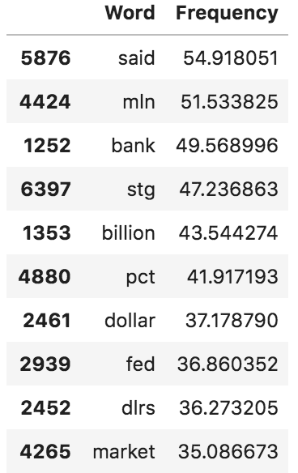
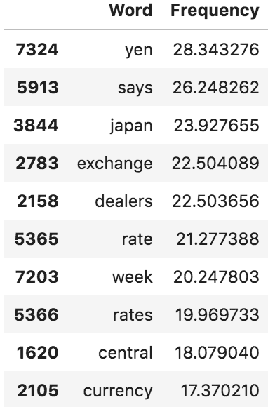
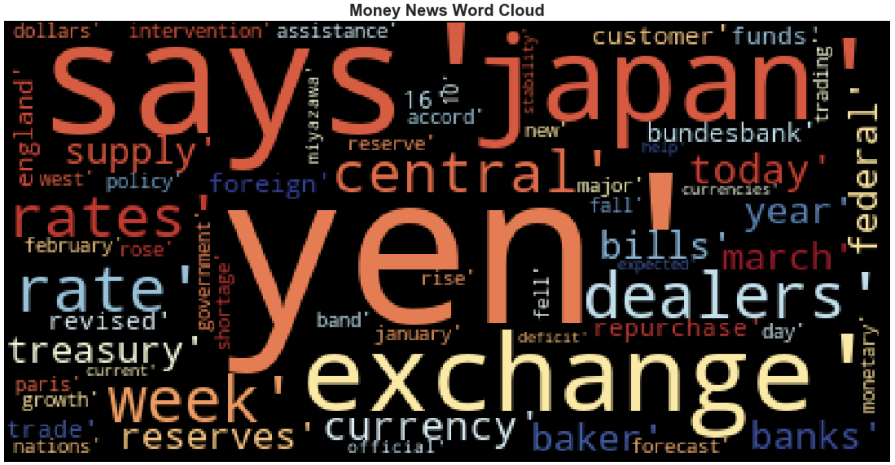

# Who are the Bossy Words?

In this activity, students will use TF–IDF to find the most relevant words from a collection of news articles that talk about money in the [Reuters Corpus](https://www.nltk.org/book/ch02.html#reuters-corpus) bundled in `NLTK`. Once they find the most relevant words, they will visualize the words using a word cloud.

## Instructions

### Getting the News About Money

You will analyze only news that talk about **money**. There are two categories on the Reuters Corpus that talk about money: `money-fx` and `money-supply`. In this section, you will filter the news by these categories.

Take a look into the [Reuters Corpus documentation](https://www.nltk.org/book/ch02.html#reuters-corpus) and check how you can retrieve the categories of a document using the `reuters.categories()` method; write some lines of code to retrieve all the news articles that are under the `money-fx` or the `money-supply` categories.

**Hint:**
You can use a comprehension list or a for-loop to accomplish this task.

### Calculating the TF–IDF Weights

Calculate the TF–IDF weight for each word on the working corpus using the `TfidfVectorizer()` class. Remember to include the `stop_words='english'` parameter.

Once you get the TF–IDF weights, create a DataFrame representation of the TF–IDF weights for each term in the working corpus. Use the `sum(axis=0)` method to calculate a measure similar to the term frequency based on the TF–IDF weight; this value will be used to rank the terms for the word cloud creation.

You should obtain a DataFrame like this:

### Retrieving the Top Words

In order to create the word cloud you should get the top words, in this case we will use a thumb rule that has been empirically tested by some NLP experts that states that words with a frequency between 10 and 30 might be the most relevant in a corpus.

Following this rule, create a new DataFrame containing only those words with the mentioned frequency.

You should get a DataFrame like this:

### Creating Word Cloud

Now you have all the pieces needed to create a word cloud based on TF–IDF weights, so use the `WordCloud` library to create it.

Your word cloud should be like this:

## Challenge: Looking for Documents that Contains Top Words

If you have time you can work on the following challenge section.

As a challenge, search for articles that contain the most relevant words. Create a function called `retrieve_docs(terms)` that receive a list of terms as a parameter and extract from the working corpus all those news articles that contain the search terms. In this function you should use the `reuters.words()` method to retrieve the tokenized version of each article as can be seen on the [Reuters Corpus documentation](https://www.nltk.org/book/ch02.html#reuters-corpus).

Once you create the function answer the following questions:

* Question 1: How many articles talk about yen?
* Question 2: How many articles talk about Japan or banks?
* Question 3: How many articles talk about England or dealers?

## Hints

* In the challenge, you might find quite useful [this post on StackOverflow](https://stackoverflow.com/a/25102099/4325668) to find any occurrence of the search terms. You should also lowercase all the words to ease your terms search.

© 2019 Trilogy Education Services, a 2U, Inc. brand. All Rights Reserved.
