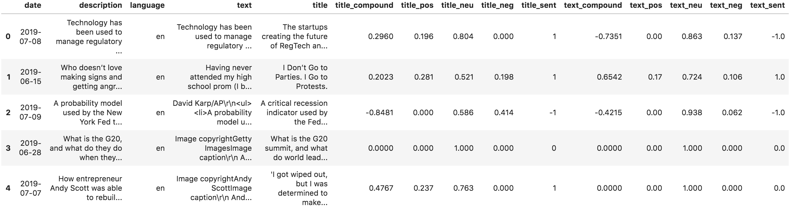
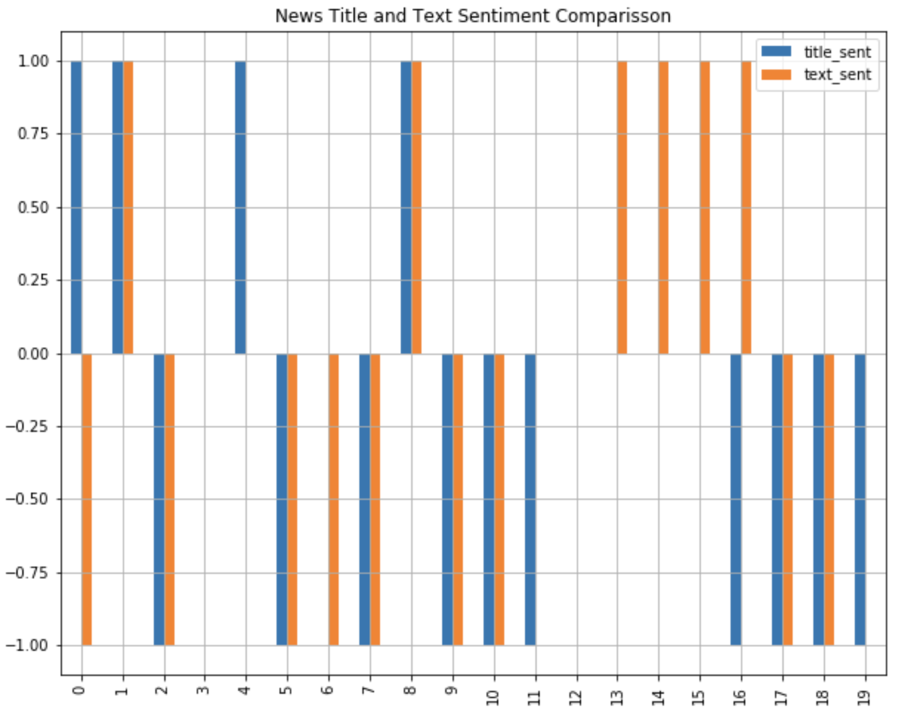

# The Feelings of the Crisis

When you read a news article, normally the headline is the hook to continue reading. However, a negative title could lead you to skip reading an article if you don't want to be in a bad mood. But is this accurate?

In this activity, you are tasked to corroborate that a news title with a negative sentiment leads to a negative content. You will use VADER sentiment to accomplish this work using the news articles that you previously downloaded in The Voice of the Crisis activity.

---

## Instructions

### Load the News Articles from the CSV File as a DataFrame

Pick the CSV file you created on The Voice of the Crisis activity and load it as a DataFrame. Remember to specify the `encoding='utf-8-sig'` parameter.

The VADER sentiment module is only trained to score sentiment in English, so create a new DataFrame with news in English only. You will learn how to score sentiment in multiple languages later.

### Calculating VADER Sentiment Score for News Titles and Text

As you know, the `compound` score could be used to get a normalized score for a sentiment. In this section, you have to create a function called `get_sentiment(score)` that will return a normalized value of sentiment for the `score` parameter based on the rules you learn. This function should return `1` for positive sentiment, `-1` for negative sentiment, and `0` for neutral sentiment.

Use the VADER sentiment module from `NLTK` to score the sentiment of every news article title and text in English; you should append ten new columns to the English news DataFrame to store the results as follows.

* Title's compound score
* Title's positive score
* Title's neutral score
* Title's negative score
* Title's normalized score (using the `get_sentiment()` function)
* Text's compound score
* Text's positive score
* Text's neutral score
* Text's negative score
* Text's normalized score (using the `get_sentiment()` function)

Your final DataFrame should look like this:

### Analyzing Sentiments Results

How the sentiment of the title and the text differs in news articles?

To answer this question, on this section you will create a bar chart contrasting the normalized sentiment for the title and the text of each news article. Use the build-in `plot()` method of the Pandas DataFrame to create a bar chart like the one bellow. Be aware that you chart might differ from this one because it is made from a different news DataFrame.

Finally, get the descriptive statistics from the English news DataFrame and discuss the analysis results with your partners.

### Hints

You can use the [`iterrows()` method](https://stackoverflow.com/a/16476974/4325668) from the Pandas DataFrame to iterate across the rows to score the sentiment for the title and the text of each news article.

© 2019 Trilogy Education Services, a 2U, Inc. brand. All Rights Reserved.
