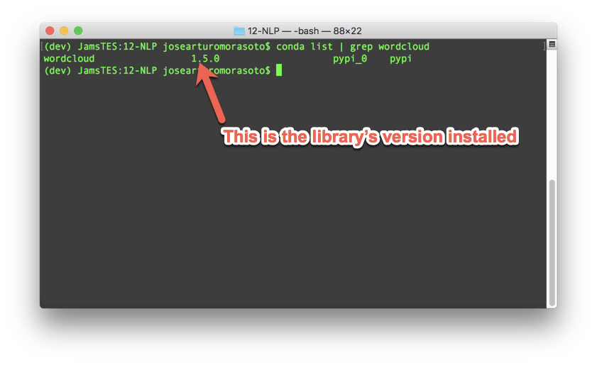
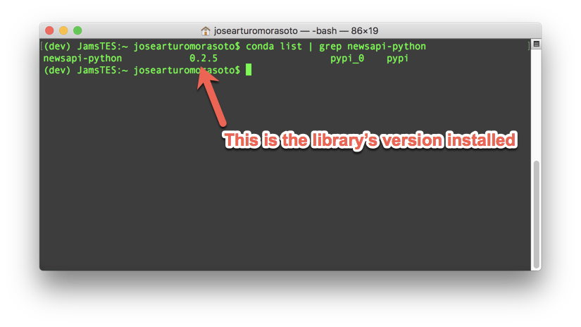
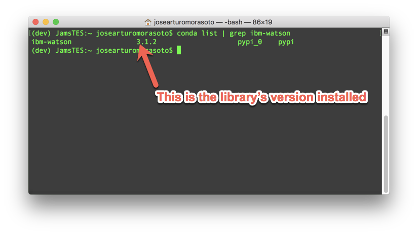
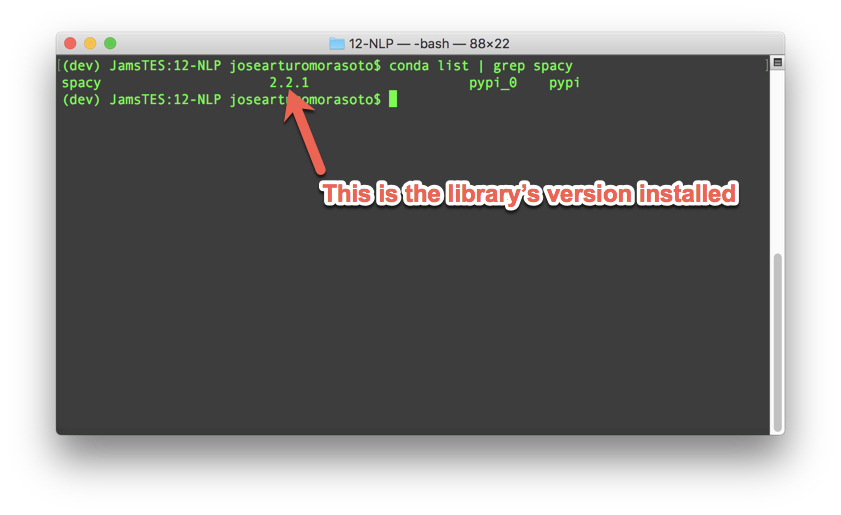
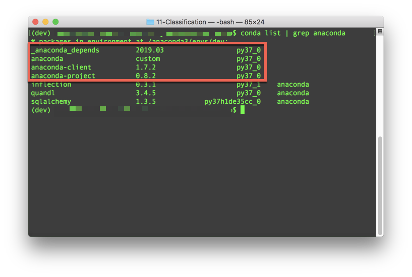
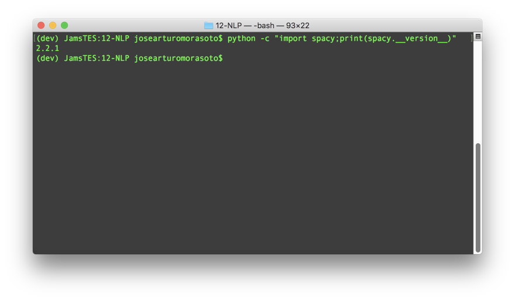

# Natural Language Processing Environment Installation Guide

This guide serves as a step by step process for setting up and validating the tools required for the natural language processing (NLP) portion of the curriculum. Without these tools, class activities and code cannot be completed.

This guide will include installation and verification steps for the following technologies:

## Wordcloud Library

In this unit, you will learn how to create word clouds visualizations to analyse text using [the `wordcloud` library](https://anaconda.org/conda-forge/wordcloud).

To install this library, open the terminal and execute the following command:

```shell
conda install -c conda-forge wordcloud
```

### Verify the Worldcloud Library Installation

Once the `wordcloud` library download is complete, verify the installation completed successfully.

* Open the terminal and use the `conda-list` function with a `grep` argument to identify if the `wordcloud` library installed successfully.

```shell
conda list | grep wordcloud
```



## News API Python Client Library

In this unit, you will learn how to analyse text and sentiment from news articles using the [New API service](https://newsapi.org/). In order to interact with this service, you should install the [News API Python client library](https://newsapi.org/docs/client-libraries/python) as follows.

Open the terminal, and execute the following command.

```shell
pip install newsapi-python
```

### Verify the News API Python Client Installation

Once the `newsapi-python` library download is complete, verify the installation completed successfully.

* Open the terminal and use the `conda-list` function with a `grep` argument to identify if the `newsapi-python` library installed successfully.

```shell
conda list | grep newsapi-python
```



## IBM Watson Python Library

In this unit, you will learn how to the [IBM Watson Tone Analyzer](https://www.ibm.com/watson/services/tone-analyzer/) to analyze tone on text communications. In order to use this service, you need to install the [IBM Watson Python Library](https://pypi.org/project/ibm-watson/) as follows.

Open the terminal, and execute the following command.

```shell
pip install --upgrade "ibm-watson>=3.0.3"
```

### Verify the IBM Watson Python Library Installation

Once the `ibm-watson` library download is complete, verify the installation completed successfully.

* Open the terminal and use the `conda-list` function with a `grep` argument to identify if the `ibm-watson` library installed successfully.

```shell
conda list | grep ibm-watson
```


## SpaCy Library Installation

In this unit, you will learn how to perform text analysis using [the `spcacy` library](https://spacy.io/).

To install this library, open the terminal and execute the following commands:

```shell
pip install -U spacy

python -m spacy download en_core_web_sm
```

The first command will install the `spacy` library, the second command is going to install the English language linguistic model that is going to be used in the activities.

### Verify the SpaCy Library Installation

Once the `spacy` library download is complete, verify the installation completed successfully.

* Open the terminal and use the `conda-list` function with a `grep` argument to identify if the `spacy` library installed successfully.

```shell
conda list | grep spacy
```



## Troubleshooting

It can be frustrating when packages do not install correctly. Use the below approaches to troubleshoot installation issues and get your machine learning libraries up and running!

### Update Conda Environment

An out-of-date Anaconda environment can create issues when trying to install new packages. Follow the below steps to update your conda environment.

1. Deactivate your current conda environment. This is required in order to update the global conda environment. Be sure to quit any running applications, such as Jupyter, prior to deactivating the environment.

    ```shell
    conda deactivate
    ```

2. Update conda.

    ```shell
    conda update conda
    ```

3. Create a fresh conda environment to use with PyViz.

    ```shell
    conda create -n mlenv python=3.7 anaconda
    ```

4. Activate the new environment.

    ```shell
    conda activate mlenv
    ```

5. Install all the required packages as it's described above.

### Anaconda is not Running!

If you have issues running or updating anaconda, you can check if the package is correctly installed by running the following command in your terminal.

```shell
conda list | grep anaconda
```

After running this command, you should see a list with the anaconda packages installed in your environment, at least the packages in the red square should be listed.



In case you guess your anaconda environment is broken, deactivate your current virtual environment and create a new one as it was described above.

### Checking the Current Version of a Package

If you want to validate which version of a package is installed in your environment, run the following command on the terminal.

```shell
python -c "import <package_name>;print(<package_name>.__version__)"
```

Where `<package_name>` is the name of the package you want to verify. For example, to corroborate the current version of the `spacy` package you should run the following command in the terminal.

```shell
python -c "import spacy;print(spacy.__version__)"
```

This is the output you should see on the terminal window.




### Package is not Installed in Windows

Sometimes you can get the following message when you install a package using `conda install`

```shell
EnvironmentNotWritableError: The current user does not have write permissions to the target environment.
 environment location: C:\ProgramData\Anaconda3
```

If you ever see this message, try running the Git Bash terminal as `Administrator`. In Windows 10 you can do it as follows.

1. Right-click on the Git Bash icon.

2. Go over the `More` option.

3. Chose the `Run as administrator` option.
