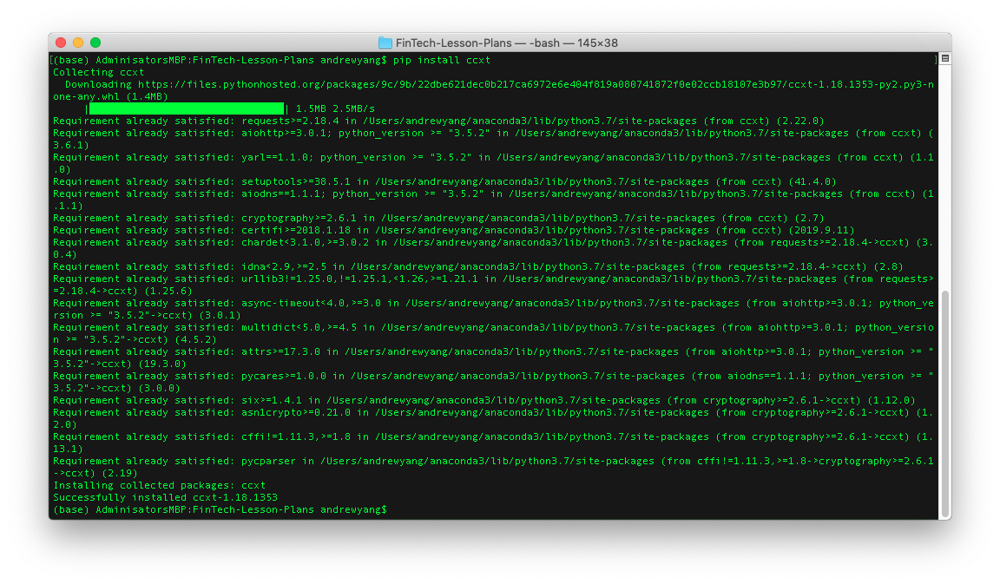
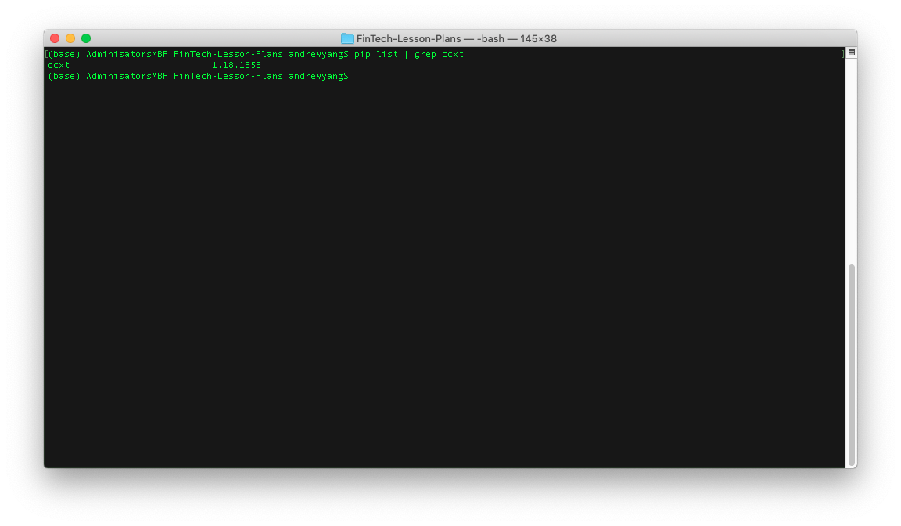
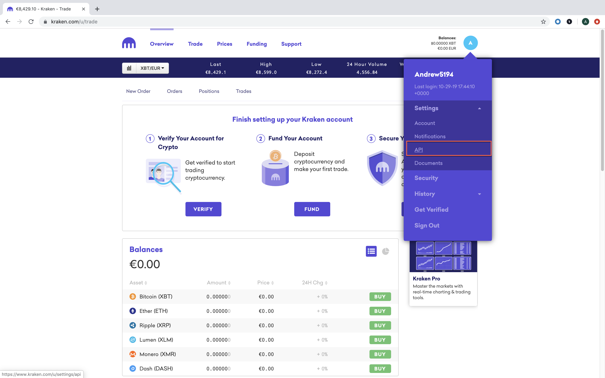
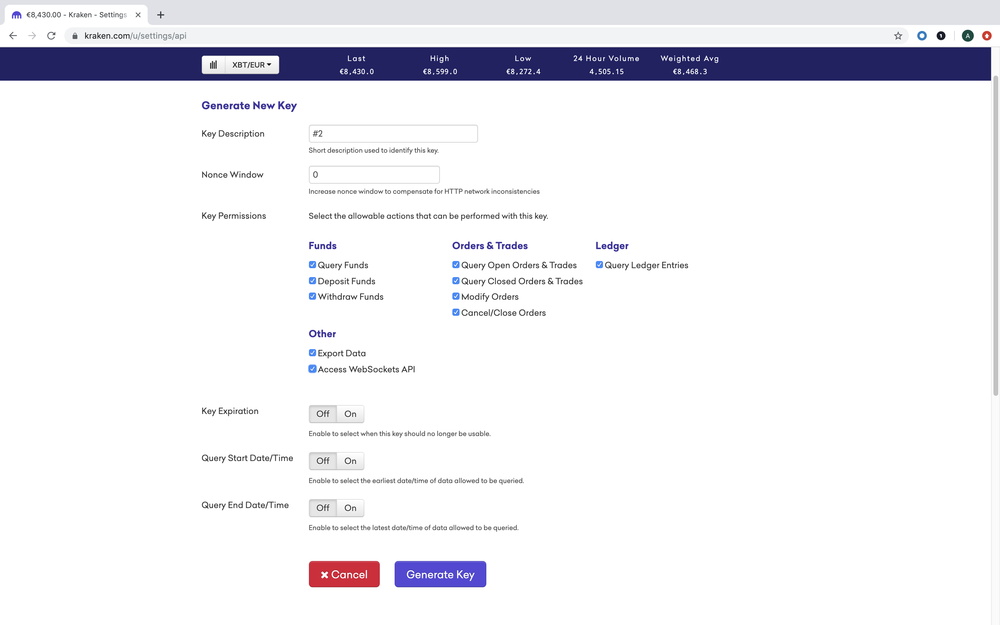
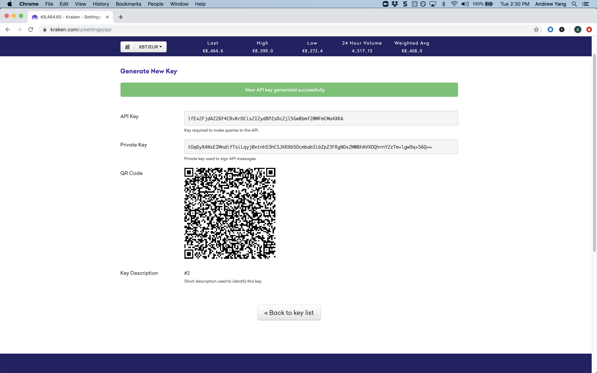
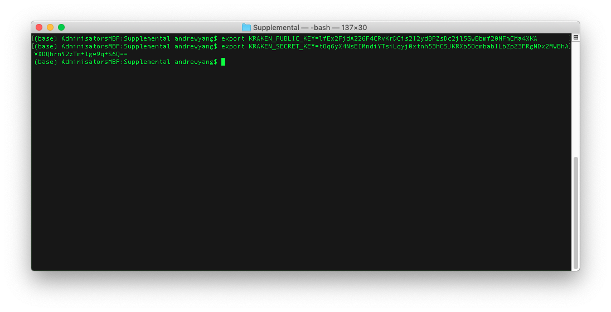

# CCXT Installation Guide

This guide serves as a step by step process for setting up and validating the ccxt Python library. Without this library, class activities and their associated code will not be able to pull historical and current pricing data from the Kraken Cryptocurrency Exchange.

## Installation

Open a terminal, and execute the following commands to install `ccxt`.

* Use the `pip install` command to download the `ccxt` module.

  ```shell
  pip install ccxt
  ```

  

## Verify Installation

Once the `ccxt` module is downloaded and installed, verify that the installation completed successfully.

* Use the `pip list` function with a `grep` argument to identify if the `ccxt` library installed successfully.

  ```shell
  pip list | grep ccxt
  ```

  

## Environment Variable Setup

Now that the `ccxt` module has been installed and verified, go to the [Kraken Cryptocurrency Exchange](https://www.kraken.com/en-us/) and sign up for an account.

Next, head to the API settings of your Kraken account and generate new API keys. Make sure to select all key permissions.

  

  

Then, after generating your API keys, open a terminal and set the `KRAKEN_PUBLIC_KEY` and `KRAKEN_SECRET_KEY` environment variables, respectively. There is no need to include quotes around your api keys when setting the environment variables.

  

  

**Note:** Unless you are setting these environment variables globally or permanently, they will need to be set each time you want to access the Kraken API via the ccxt library.

## Troubleshooting

It can be frustrating when packages do not install correctly, therefore use the below approaches to troubleshoot any installation or usage issues.

### Update Conda Environment

An out-of-date Anaconda environment can create issues when trying to install new packages. Follow the below steps to update your conda environment.

1. Deactivate your current conda environment. This is required in order to update the global conda environment. Be sure to quit any running applications, such as Jupyter, prior to deactivating the environment.

    ```shell
    conda deactivate
    ```

2. Update conda.

    ```shell
    conda update conda
    ```

3. Create a fresh conda environment to use with `ccxt`.

    ```shell
    conda create -n algotrading python=3.7 anaconda
    ```

4. Activate the new environment.

    ```shell
    conda activate algotrading
    ```

5. Install the `ccxt` package.

    ```shell
    pip install ccxt
    ```

---

© 2019 Trilogy Education Services, a 2U, Inc. brand. All Rights Reserved.
