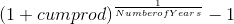
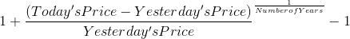
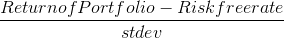
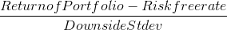

# Evaluation Metric Calculations

Below is a list of evaluation metrics commonly used to evaluate portfolio/investment performance.

### Annual Return

A time weighted annual percentage representing the return on an investment over a period of time.

  

### Annual Volatility

The annualized degree of variation in trading prices over time.

  

### Sharpe Ratio

The return of investment compared to its risk, measured by the difference between the return on investment and the risk-free return.

  

### Downside Deviation/Return

The measure of risk for returns that are below the minimal acceptable return. Downside deviation is calculated similar to standard deviation; however, deviation is only focused on returns that are less than the minimum acceptable return.

### Sortino Ratio

The quotient of harmful volatility and overall volatility. The Sortino ratio focuses on downside deviation rather than standard deviation.

  
